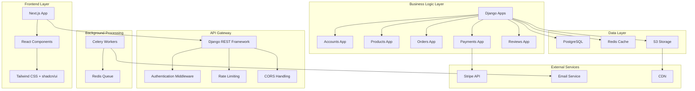
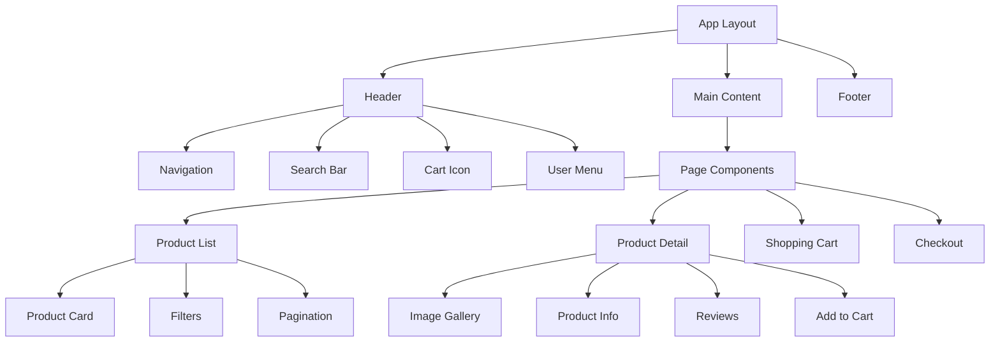
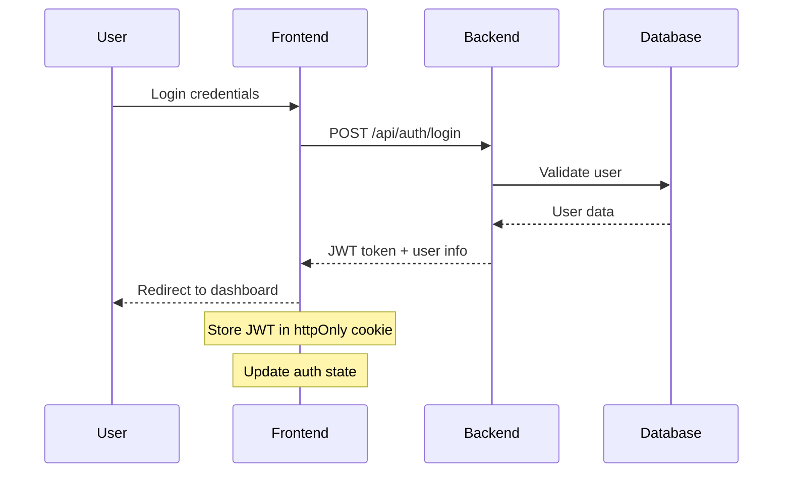
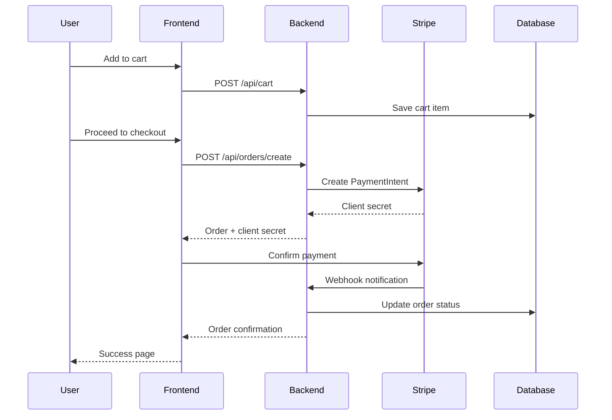
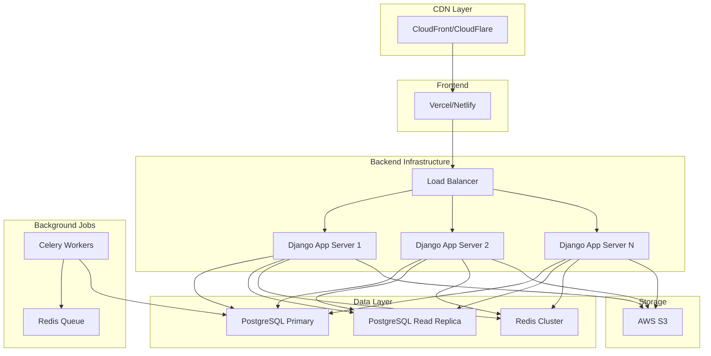

# Architecture Documentation - Unique and Antique E-commerce Platform

## 🏗️ System Architecture Overview



## 🎯 Design Principles

### 1. **Separation of Concerns**
- **Frontend**: Handles UI/UX, user interactions, and presentation logic
- **Backend**: Manages business logic, data persistence, and API endpoints
- **Database**: Stores structured data with proper relationships
- **Cache**: Improves performance for frequently accessed data

### 2. **Scalability**
- Horizontal scaling through containerization
- Database read replicas for high-traffic scenarios
- CDN for static asset delivery
- Background job processing for heavy operations

### 3. **Security**
- JWT-based authentication
- HTTPS everywhere
- Input validation and sanitization
- Rate limiting and DDoS protection
- Secure payment processing through Stripe

### 4. **Performance**
- Redis caching for database queries
- Image optimization and lazy loading
- Database indexing for fast queries
- Async processing for non-critical operations

## 🔧 Backend Architecture

### Django Project Structure
```
backend/
├── config/                 # Django settings and configuration
│   ├── settings/
│   │   ├── base.py        # Base settings
│   │   ├── development.py # Development settings
│   │   ├── production.py  # Production settings
│   │   └── testing.py     # Test settings
│   ├── urls.py            # Main URL configuration
│   └── wsgi.py            # WSGI application
├── apps/                  # Django applications
│   ├── accounts/          # User management
│   │   ├── models.py      # User, Profile models
│   │   ├── serializers.py # DRF serializers
│   │   ├── views.py       # API views
│   │   └── urls.py        # App URLs
│   ├── products/          # Product catalog
│   │   ├── models.py      # Product, Category, ProductImage
│   │   ├── serializers.py # Product serializers
│   │   ├── views.py       # Product API views
│   │   └── filters.py     # Product filtering
│   ├── orders/            # Order management
│   │   ├── models.py      # Order, OrderItem, TrackingHistory
│   │   ├── serializers.py # Order serializers
│   │   ├── views.py       # Order API views
│   │   └── tasks.py       # Celery tasks
│   ├── payments/          # Payment processing
│   │   ├── models.py      # Payment model
│   │   ├── views.py       # Stripe integration
│   │   └── webhooks.py    # Stripe webhooks
│   └── reviews/           # Reviews and ratings
│       ├── models.py      # Review model
│       ├── serializers.py # Review serializers
│       └── views.py       # Review API views
├── utils/                 # Shared utilities
│   ├── permissions.py     # Custom permissions
│   ├── pagination.py      # Custom pagination
│   └── exceptions.py      # Custom exceptions
└── requirements.txt       # Python dependencies
```

### Database Schema

#### Core Models
```python
# User Model (extends Django's AbstractUser)
class User(AbstractUser):
    phone = models.CharField(max_length=20)
    role = models.CharField(choices=[('customer', 'Customer'), ('admin', 'Admin')])
    created_at = models.DateTimeField(auto_now_add=True)
    updated_at = models.DateTimeField(auto_now=True)

# Category Model
class Category(models.Model):
    name = models.CharField(max_length=100)
    slug = models.SlugField(unique=True)
    parent = models.ForeignKey('self', null=True, blank=True)
    image = models.ImageField(upload_to='categories/')

# Product Model
class Product(models.Model):
    title = models.CharField(max_length=200)
    slug = models.SlugField(unique=True)
    description = models.TextField()
    price = models.DecimalField(max_digits=10, decimal_places=2)
    stock = models.PositiveIntegerField()
    category = models.ForeignKey(Category, on_delete=models.CASCADE)
    attributes = models.JSONField(default=dict)
    is_active = models.BooleanField(default=True)
    created_at = models.DateTimeField(auto_now_add=True)
    updated_at = models.DateTimeField(auto_now=True)

# Order Model
class Order(models.Model):
    STATUS_CHOICES = [
        ('pending', 'Pending'),
        ('confirmed', 'Confirmed'),
        ('packed', 'Packed'),
        ('shipped', 'Shipped'),
        ('delivered', 'Delivered'),
        ('returned', 'Returned'),
    ]
    user = models.ForeignKey(User, on_delete=models.CASCADE)
    total_amount = models.DecimalField(max_digits=10, decimal_places=2)
    status = models.CharField(max_length=20, choices=STATUS_CHOICES)
    payment_method = models.CharField(max_length=20)
    placed_at = models.DateTimeField(auto_now_add=True)
```

## 🎨 Frontend Architecture

### Next.js Project Structure
```
frontend/
├── src/
│   ├── components/        # Reusable UI components
│   │   ├── ui/           # shadcn/ui components
│   │   ├── layout/       # Layout components
│   │   ├── product/      # Product-related components
│   │   ├── cart/         # Cart components
│   │   └── common/       # Common components
│   ├── pages/            # Next.js pages
│   │   ├── api/          # API routes (if needed)
│   │   ├── products/     # Product pages
│   │   ├── account/      # User account pages
│   │   └── admin/        # Admin pages
│   ├── hooks/            # Custom React hooks
│   │   ├── useAuth.ts    # Authentication hook
│   │   ├── useCart.ts    # Cart management hook
│   │   └── useApi.ts     # API interaction hook
│   ├── utils/            # Utility functions
│   │   ├── api.ts        # API client
│   │   ├── auth.ts       # Authentication utilities
│   │   └── helpers.ts    # General helpers
│   ├── types/            # TypeScript type definitions
│   │   ├── user.ts       # User types
│   │   ├── product.ts    # Product types
│   │   └── order.ts      # Order types
│   ├── styles/           # Global styles
│   │   └── globals.css   # Tailwind CSS imports
│   └── lib/              # Library configurations
│       ├── stripe.ts     # Stripe configuration
│       └── axios.ts      # Axios configuration
├── public/               # Static assets
│   ├── images/          # Static images
│   └── icons/           # Icon files
├── package.json         # Node.js dependencies
├── next.config.js       # Next.js configuration
├── tailwind.config.js   # Tailwind CSS configuration
└── tsconfig.json        # TypeScript configuration
```

### Component Architecture


## 🔄 Data Flow

### User Authentication Flow


### Product Purchase Flow


## 🚀 Deployment Architecture

### Development Environment
```yaml
# docker-compose.yml
version: '3.8'
services:
  db:
    image: postgres:13
    environment:
      POSTGRES_DB: unique_antique
      POSTGRES_USER: postgres
      POSTGRES_PASSWORD: password
    ports:
      - "5432:5432"
  
  redis:
    image: redis:6-alpine
    ports:
      - "6379:6379"
  
  backend:
    build: ./backend
    ports:
      - "8000:8000"
    depends_on:
      - db
      - redis
    environment:
      - DEBUG=True
      - DATABASE_URL=postgresql://postgres:password@db:5432/unique_antique
      - REDIS_URL=redis://redis:6379/0
  
  frontend:
    build: ./frontend
    ports:
      - "3000:3000"
    depends_on:
      - backend
    environment:
      - NEXT_PUBLIC_API_URL=http://backend:8000/api
```

### Production Environment


## 🔒 Security Architecture

### Authentication & Authorization
- **JWT Tokens**: Stateless authentication
- **Role-based Access Control**: Customer vs Admin permissions
- **API Rate Limiting**: Prevent abuse and DDoS
- **CORS Configuration**: Secure cross-origin requests

### Data Protection
- **Input Validation**: Sanitize all user inputs
- **SQL Injection Prevention**: Use Django ORM
- **XSS Protection**: Content Security Policy headers
- **HTTPS Everywhere**: Encrypt all communications

### Payment Security
- **PCI Compliance**: Through Stripe integration
- **Webhook Verification**: Validate Stripe webhooks
- **Secure Storage**: No card data stored locally

## 📊 Monitoring & Observability

### Application Monitoring
- **Error Tracking**: Sentry for error monitoring
- **Performance Monitoring**: New Relic/DataDog
- **Uptime Monitoring**: Pingdom/UptimeRobot
- **Log Aggregation**: ELK Stack or CloudWatch

### Business Metrics
- **User Analytics**: Google Analytics
- **Conversion Tracking**: E-commerce events
- **A/B Testing**: Feature flag management
- **Revenue Tracking**: Stripe dashboard integration

---

**Last Updated**: 2025-10-02
**Version**: 1.0
**Next Review**: Architecture review meeting
